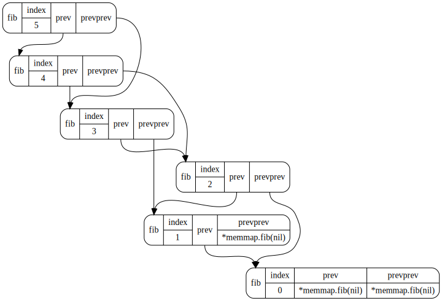

# memmap [](https://travis-ci.org/bradleyjkemp/memmap) [](https://coveralls.io/github/bradleyjkemp/memmap?branch=master) [](https://goreportcard.com/report/github.com/bradleyjkemp/memmap) [](https://godoc.org/github.com/bradleyjkemp/memmap) 

Take arbitrary data structures and turn them into a easy to understand graph:



Just pass a pointer to your data structure like so: ```memmap.Map(out, &data)``` and then pipe the output into graphviz.
