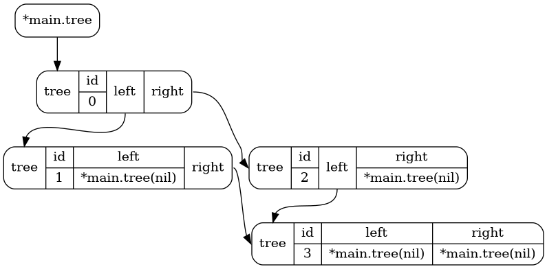

# Generating a diagram
This example shows how to generate a visual diagram of a data structure using `memviz` and `graphviz`.

## Setup
First, make sure you have installed `graphviz` on your system by following the instructions [here](https://graphviz.org/download/).

## Running the example
After installing `graphviz`, run the example code to generate the dot file:
```bash
go run main.go
```

Next, use the dot file with the graphviz `dot` command to generate a PNG diagram:
```bash
dot -Tpng example-tree-data -o diagram.png
```

The resulting `diagram.png` image will look like this:



For more examples see the tests in [memviz_test.go](https://github.com/bradleyjkemp/memviz/blob/master/memviz_test.go).
